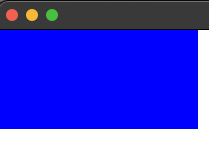
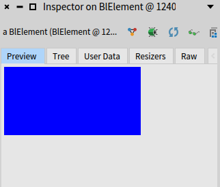
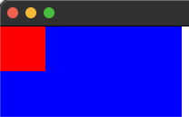
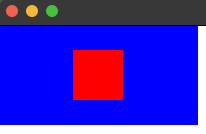
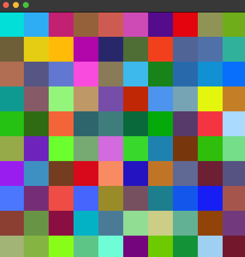

# Introduction to Bloc

## Credits
These introduction materials are adapted from the [Pharo graphics book](https://github.com/SquareBracketAssociates/Booklet-Graphics) by R. de Villemeur, S. Ducasse and A.Plantec, and completed by various exercises.


## Installation

Bloc is available on [github](https://github.com/pharo-graphics/Bloc).
To install it in a Pharo image, open a playground and execute the following snippet:

```Smalltalk
Metacello new
	baseline: 'Bloc';
	repository: 'github://pharo-graphics/Bloc:master/src';
	load
```
## First elements

After Bloc has loaded, you can start playing with it.
**Bloc** distinguishes itself by prioritizing object composition over
inheritance as its core design principle. This means that instead of relying
heavily on complex inheritance hierarchies, **Bloc** encourages building user
interface components by combining and customizing basic building blocks.

Note that Toplo is a new skinnable widget library built on top of Bloc.

### BlElement: The foundation of Bloc components

Every visual element within **Bloc** stems from the fundamental class
`BlElement`. This versatile class serves as the foundation upon which you can
construct more intricate components. By directly customizing and combining
`BlElement` instances, you gain granular control over the appearance and
behavior of your UI elements.

#### Navigating Bloc's spatial landscape

**Bloc** introduces two key concepts for managing the visual environment: 
`BlUniverse` and `BlSpace`. Imagine `BlUniverse` as a container housing a
collection of individual `BlSpace` instances. Each `BlSpace` represents a
distinct operating system window where your Pharo application unfolds. If you
have multiple windows open simultaneously, they'll be neatly organized within
the `BlUniverse`, providing a clear overview of your active spaces.

#### Ready to Build: Creating Your First Bloc Component

```smalltalk
blueRectangle := BlElement new
	geometry: BlRectangleGeometry  new;
	size: 200 @ 100;
	background: Color blue;
	yourself.
blueRectangle openInNewSpace
```



1. **Start with a blank canvas:** Begin by creating a new `BlElement`. 
This serves as the foundation for your user interface element, initially appearing
invisible.
2. **Define its shape:** In Bloc, the element's visual representation is
determined by its geometry. 
In this example, we'll use a simple rectangle, but more complex shapes are also possible (explored in further detail later).
3. **Set its dimensions and appearance:** 
Specify the element's size and color to customize its visual characteristics.
4. **Bring it to life:** Finally, open the element in a new space, making it visible on the screen.


In our example, we can observe the state of your element by inspecting the `blueRectangle` variable. We can observe a graphical overview of the element, as well as its state:



Elements are organized in trees. 
To compose tree of elements, we select a root element and we add children.

```smalltalk
redRectangle := BlElement new
	geometry: BlRectangleGeometry  new;
	size: 50 @ 50;
	background: Color red; 
	yourself.
blueRectangle addChild: redRectangle
```

1. **Start with a root element of your choice:** in our example, we reuse the `blueRectangle` element.
2. **Define the new element:** This is done like any other element, such as the `blueRectangle` element.
In this example, we will use a red rectangle, but smaller than the blue one.
3. **Add the new element as a child of the root element:** 
The `addChild:` api adds leaf elements to a root.
4. **Bring it to life:** If the `blueRectangle` is still open, it automatically updates with the `redRectangle`. Else, re-execute all the code to open the root in a new space, making it visible on the screen.



The red element is placed on the top left corner of its parent, the blue element.
By default, the position of `BlElement` instances is `0@0`.
The position of elements is configured by using the `position:` api, such as in the following:

```Smalltalk
redRectangle position: 75@25. 
```



Notice that if you did not close the original space opened for the `blueRectangle` element, the display automatically updates when the `redRectangle` position changes.

## Spaces: where elements are displayed

Spaces represent windows in which elements are displayed.
They are explicitely controlled by instantiating `BlSpace` objects.
A space has a root element, to which other elements are attached using the `addChild:` api.
In the following example, we create a new space in which we add our two rectangles:

```Smalltalk
space := BlSpace new.
space root addChild: blueRectangle.
space root addChild: redRectangle.
space show
```
An element can only be the child of a single other element.
If an element is already added as a child in a space, trying to add that element to a new space will raise an exception. 
One solution is to create new instances of that element to add it to another space.

## Exercise 1: color grid

Create a $10\times10$ grid of squares, each with a random color, and display it in a space.

